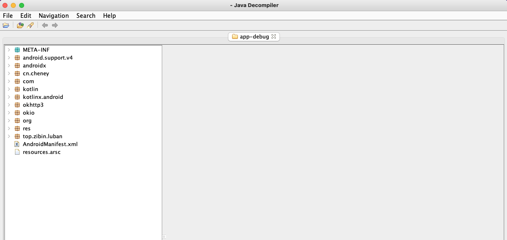
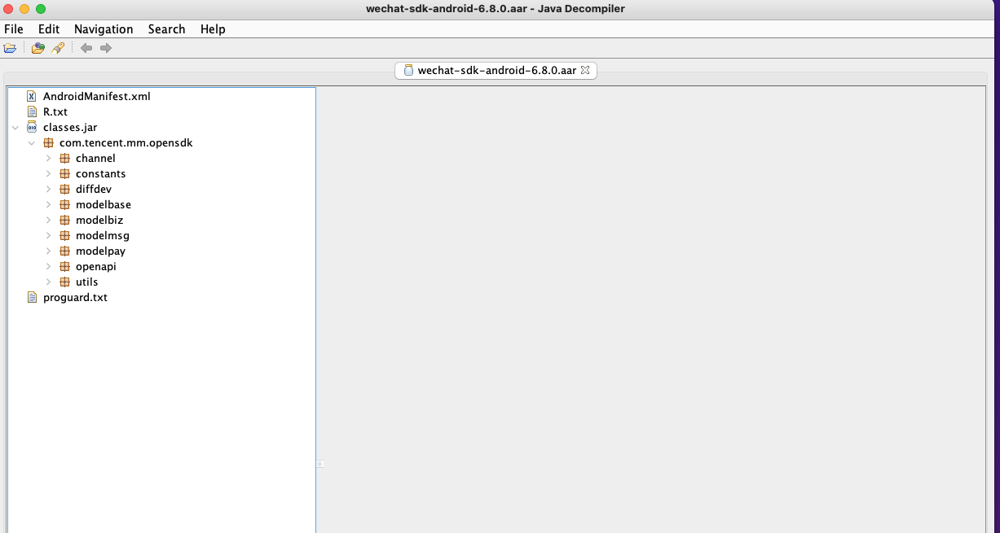

### 安装

#### python3环境安装

brew install python3


#### skyeye安装


pip3 install skyeye


#### 扫描APK中代码引用

1. 本地创建config.yaml文件,格式如下

```yaml
- className: "com.xx.xx.yourClassName1"
  methodName: "methodName"
- className: "com.xx.xx.yourClassName2"
  filedName: "filedName"
```

* 如果methodName,filedName不填写,会扫描className所有方法和变量的外部引用情况
* 方法和字段名都是模糊匹配，例如methodName(x,x)只需要填写methodName即可
* 扫描父类的字段和方法，其子类的也会被扫描

2. 扫描

```bash
skyeye scan
      -i , --input       输入扫描的APK路径
      -c , --config      扫描配置yaml文件路径
      -o , --output      输出结果的文件夹路径 【可选，默认运行文件夹路径】
```

3. 输出结果，格式如下

```json
{
    "cn.Test:<init>()V": [
        {
            "caller_class": "cn.xx.MainActivity",
            "caller_method": "protected onCreate(Landroid.os.Bundle;)V",
            "invoke_num": " 58"
        }
    ],
    "cn.Test.staticString": [
        {
            "caller_class": "cn.xx.MainActivity",
            "caller_method": "protected onCreate(Landroid.os.Bundle;)V",
            "invoke_num": " 60"
        }
    ]
}
```

#### 反编译

```bash
skyeye dec
      -i , --input       输入扫描的APK路径
      -o , --output      输出结果的文件夹路径 【可选，默认运行文件夹路径】
```



#### GUI打开源码

```bash
skyeye jd
      -i , --input   目标class文件路径 或者 class文件夹路径
```



#### 查看当前版本

```bash
skyeye -v 
输出版本同时，检查更新
```

### changeLog

#### 3.7.0

- 删除项目对distutils的依赖
  
#### 3.6.0

- 支持扫描子父类的继承方法和字段

#### 3.4.2

- 支持APK反编译

#### 3.2.0

- 支持静态变量&&变量扫描
- 支持扫描类里面所有变量&&方法

#### 3.1.0

- 增加结果报告执行函数输出
- 增加PyYaml的依赖

#### 3.0.0在侧边

- 扫描特定类的所有方法外部的引用
- 扫描特定类的特定方法的外部引用
- 支持图片的裁剪选择


